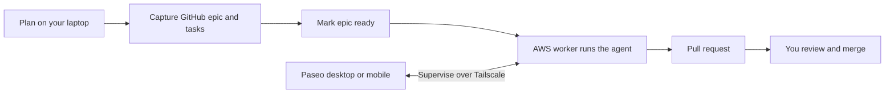

# Factory

**Turn planned GitHub issues into pull requests on workers you own.**

`fffactory` provisions and operates the Yaunder software factory in your AWS
account. You prepare work in GitHub, mark an epic ready, and a worker runs a
coding agent through implementation, tests and a pull request. You follow its
progress and answer permission requests through Paseo, then review and merge
the result in GitHub.

[How it works](#how-it-works) · [Install](#install) ·
[Create your factory](#create-your-factory) ·
[Add your first repository](#add-your-first-repository) ·
[Full onboarding runbook](MACHINE_ONBOARDING.md)

## How it works



Three pieces work together:

| Piece | What it does |
| --- | --- |
| **fffactory** | Creates AWS infrastructure, installs pinned tools on workers, synchronizes repositories and enables the dispatch schedule. |
| **Paseo** | Runs agent sessions in isolated Git worktrees and lets you supervise them from desktop or mobile. |
| **FFFlow** | Provides the planning and development workflow: captured issues, implementation, tests and pull requests. |

One local `.fffactory/factory.json` describes your factory: its AWS account,
worker, repositories, schedule and pinned release. The CLI uses Terraform to
provision infrastructure and Tailscale SSH to install and verify the worker.
On each scheduled run, the dispatcher checks for ready FFFlow epics and starts
eligible work. The current workflow runs Claude Code, with one epic at a time
per worker; Codex is also installed, but FFFlow dispatch uses Claude Code.

The walkthrough below gets one worker running your first repository and
opening a pull request. Application hosting and deployment remain part of
your repository's own workflow.

## Before you start

Have these ready:

- **A workstation:** Apple Silicon macOS or x86-64 Linux, with OpenSSH,
  `curl` and a logged-in Tailscale client.
- **An AWS account and credentials** that can create the factory's network,
  EC2 worker, IAM roles, S3 state bucket and Secrets Manager entries. The
  [prerequisites](MACHINE_ONBOARDING.md#0-prerequisites) list the permissions;
  there is no bundled least-privilege operator policy yet.
- **A Tailscale tailnet** whose admin can configure worker access and create
  a tagged auth key.
- **GitHub, OpenAI and Anthropic accounts** to enroll on the worker, plus a
  Paseo desktop or iOS client on the same tailnet.
- **A GitHub repository** the worker's GitHub account can read and write, plus
  Claude Code and [GitHub CLI](https://cli.github.com) on your laptop for
  planning work and capturing issues.

You pay for the AWS resources and agent usage in your accounts. Running the
factory needs no checkout of this repository, Node, Bun or local Terraform;
`fffactory` downloads its managed Terraform.

## Install

The public repository currently contains source only; the first public
release has not been published yet. Once it is available, install from
`yaunder/fffactory` releases without a GitHub login or token:

```bash
curl -fsSL https://github.com/yaunder/fffactory/releases/latest/download/install.sh | sh
export PATH="$HOME/.local/bin:$PATH"
fffactory --version
```

The installer verifies the executable against the release's `SHA256SUMS` and
places it in `~/.local/bin`. Add that directory to your shell's `PATH` for
future sessions. The version command should print the installed release.
GitHub authentication is needed later for repository access and creating
issues and pull requests, not for installation.

To select a release or another install directory, set `FFFACTORY_VERSION` or
`FFFACTORY_INSTALL_DIR` for the installer. See
[installation options](docs/specs/release.md#installsh).

## Create your factory

These steps run on your workstation unless marked otherwise. Keep using the
same directory for factory commands; from elsewhere, select its document with
`--instance PATH`. For detailed checks and recovery steps, follow the
[machine onboarding runbook](MACHINE_ONBOARDING.md).

### 1. Initialize and configure

```bash
mkdir my-factory
cd my-factory
fffactory init
```

This creates `.fffactory/factory.json`, generates a permanent factory ID and
pins the installed release. It creates no AWS resources.

Edit the generated document using these choices. `FACTORY_ID` below means
the ID printed by `init`; keep that ID and the generated `release` unchanged.

| Field | Example or choice |
| --- | --- |
| `name` | `My factory` |
| `aws.account_id`, `aws.region` | Your 12-digit account ID and Region, such as `us-east-1` |
| `state_backend.bucket` | A globally unique name starting with `FACTORY_ID-`, such as `FACTORY_ID-state-<account-id>` |
| `network.vpc_cidr`, `network.public_subnet_cidr` | `10.78.0.0/16` and `10.78.1.0/24` |
| `network.availability_zone` | An Availability Zone in your Region, such as `us-east-1a` |
| `tailscale.tag` | `tag:software-factory` |
| `hosts` | `[{ "key": "builder-1", "instance_type": "m7i.xlarge", "root_volume_gib": 200 }]` |

Leave repositories and dispatch out until the worker is enrolled. The
[example configuration](examples/factory.json) shows the document's full
shape; adapt its fields rather than replacing your generated ID and release.
Back up your configuration: it is your factory's desired state.

Select your configured AWS profile, then check the document and workstation:

```bash
export AWS_PROFILE=your-profile
fffactory validate
fffactory doctor
```

If you use the standard AWS credential chain, omit the profile export. The
CLI checks the caller's account against your configuration before operating.
At this point, `validate` should report only `tailscale.auth_key_secret`
missing; `doctor` exits 2 until that is supplied. Resolve any other findings.

### 2. Prepare access and store secrets

Follow [Prepare the tailnet](MACHINE_ONBOARDING.md#5-prepare-the-tailnet)
to add the tag ownership, network grant and SSH rule. The policy must allow
SSH as `fffactory-admin` and `factory`, and Paseo access on port 6767. Create
a reusable, pre-approved, non-ephemeral auth key with your factory's tag.

Then store that key and a password you choose for Paseo:

```bash
fffactory secret set tailscale-auth-key
fffactory secret set paseo-password --host builder-1
fffactory validate
fffactory doctor
```

Enter values at the hidden prompts. The CLI stores them in AWS Secrets
Manager and writes only their ARNs into factory.json. Keep the Paseo password
in your password manager for client enrollment. `validate` should now report
`Complete`, and `doctor` should exit 0 with all checks ready.

### 3. Provision the worker

```bash
fffactory plan
fffactory apply
```

Review the plans at the terminal. On the first apply, you approve creation of
the state bucket, then approve the factory plan. The CLI provisions AWS
resources, waits for the worker to join Tailscale, and installs its release.
First boot can take up to 15 minutes.

Success means the worker is installed and verified, with account enrollment
pending. Follow the login instructions it prints next.

### 4. Enroll accounts and connect Paseo

Replace `HOSTNAME` with the worker name printed by apply, such as
`fff-k3x9q2ab-builder-1`. Log in as the worker's **`factory`** user:

```bash
tailscale ssh factory@HOSTNAME
gh auth login --hostname github.com --git-protocol https --web
gh auth status
codex login --device-auth
codex login status
claude auth login
claude auth status
exit
```

Complete each browser or device-code flow. Once all three account checks
succeed, verify enrollment from your workstation:

```bash
fffactory apply
fffactory status
```

Review and approve the new plan. `status` should exit 0 and report
`Ready on release R`. Applying again matters: status reads the enrollment
verification recorded by apply.

In Paseo, add a direct connection to the worker's full MagicDNS name on port
`6767`, with TLS off because Tailscale carries the connection, and enter the
Paseo password. See [Enroll Paseo clients](MACHINE_ONBOARDING.md#10-enroll-paseo-clients)
for how to find that name. You should see the worker in the client.

## Add your first repository

The factory assumes each target repository has already adopted
[FFFlow](https://github.com/bryonjacob/ffflow), with GitHub issue capture enabled
on its configured branch. See the FFFlow repository for adoption instructions.

### 1. Assign it to the worker

Back in your factory directory, add this top-level field to
`.fffactory/factory.json`, replacing `OWNER/NAME` with your repository:

```json
"repositories": [
  {
    "key": "app",
    "remote": "https://github.com/OWNER/NAME",
    "path": "app",
    "branch": "main"
  }
]
```

Add these fields **inside the existing `builder-1` host object**, retaining
its instance settings and `paseo_password_secret`:

```json
"repositories": ["app"],
"dispatch": {
  "enabled": true,
  "cron": "*/15 * * * *",
  "timezone": "UTC",
  "provider": "claude",
  "model": "YOUR_CLAUDE_MODEL_ID",
  "mode": "default",
  "cwd": "/home/factory"
}
```

These are JSON fragments to merge into the document. Replace
`YOUR_CLAUDE_MODEL_ID` with a model supported by the worker's Claude Code
account. Every dispatch field is required. This schedule checks every 15
minutes; `default` mode lets you answer agent permission requests in Paseo.

```bash
fffactory validate
fffactory plan
fffactory apply
fffactory status
```

Review and approve the plan when apply prompts. Success means repositories
are `synchronized`, dispatch is `active`, and status exits 0. Your primary
checkout is at `/workspace/repos/app`; Paseo creates separate worktrees for
agent work. If dispatch is pending, follow the reported next action and apply
again. See [repository placement](MACHINE_ONBOARDING.md#11-place-repositories-and-request-dispatch)
for troubleshooting.

### 2. Send the first piece of work

In Claude Code on your laptop, use FFFlow to plan a small change, break it into
tasks and capture the issues in GitHub. Run each step after completing the
previous one:

```text
/fff:plan-chat
/fff:plan-breakdown
/fff:plan-capture
```

In GitHub, add the **`ready`** label to the captured epic (already labelled
`ffflow-epic`). The epic needs captured tasks and no outstanding external
dependencies; the [readiness rules](SDLC.md#readiness) describe the checks.

On the next scheduled run, the dispatcher starts a Paseo agent running
`/fff:work-epic <id>` in its own worktree. Watch it in Paseo and answer any
permission requests. **Your first successful run ends with an open pull
request.** Review and merge it yourself; the factory never merges. If an epic
is skipped, see [Mark an epic ready](MACHINE_ONBOARDING.md#12-mark-an-epic-ready).

## Operate and learn more

| Command | Use it to |
| --- | --- |
| `fffactory doctor` | Check workstation prerequisites and configuration. |
| `fffactory plan` | Review proposed changes without applying them. |
| `fffactory apply` | Review and apply a plan under the factory-wide lock. |
| `fffactory status` | Read worker readiness and dispatch state. |
| `fffactory upgrade` | Use a newer release to review and apply a release-pin change. |

Operate with the release factory.json pins; change that pin only through
`fffactory upgrade`. A saved plan can also be applied with `--plan-id ID`
after reviewing and approving that exact plan. Changed configuration, state
or release invalidates it: plan again. See [plan and apply](docs/specs/plan-apply.md).

- [Machine onboarding](MACHINE_ONBOARDING.md) — full setup, expected results,
  recovery and upgrades.
- [Software development lifecycle](SDLC.md) — planning, readiness, dispatch
  and worktree ownership.
- [v2 design](docs/designs/fffactory-v2.md) and [specifications](docs/specs/) —
  architecture and behavior contracts.
- [Roadmap](docs/roadmap/fffactory-v2-roadmap/roadmap.md) — remaining work,
  including multiple workers and guided retirement/replacement.
- [Portable execution and supervision](docs/designs/portable-execution.md) —
  a discussion draft for future execution backends.

v1 is frozen and its tooling has been removed. These instructions cover v2
only; [decision 0002](docs/decisions/0002-fffactory-v2.md) records the transition.

## Contribute

For development of `fffactory` itself, read [AGENTS.md](AGENTS.md), install
Bun and `just`, then run from this checkout:

```bash
just dev-install
just check-all
```

The checks exercise repository code without AWS credentials or factory state.
Maintainers: [prepare and protect a fresh public repository](docs/public-repository.md).

Licensed under the [MIT License](LICENSE), copyright Yaunder.
