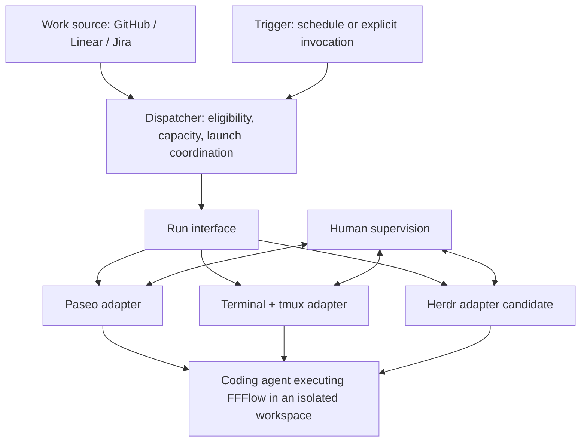

# Portable execution and supervision

Status: discussion draft for the conversation with Brian. The terminal/tmux
product requirement below is confirmed; the interfaces and ownership changes
are proposals. This document does not change shipped behavior or supersede
[AGENTS.md](../../AGENTS.md), [SDLC.md](../../SDLC.md), or the
[adopted v2 design](fffactory-v2.md).

## What we want to offer

A client should be able to use the factory without adopting Paseo. The factory
should still select ready work, start coding agents in isolated workspaces,
and give humans a way to observe and intervene.

**Terminal/tmux must support unattended dispatch with reconnectable
supervision.** A prepared worker where a human must start every task does not
meet this requirement. Once enrollment and dispatch activation are complete,
the operator should be able to close their laptop while the worker picks up
work, then reconnect to inspect progress or answer a question.

The replaceable capability is **hosting and supervising a run**. Paseo is the
current implementation. Terminal/tmux is the proposed second implementation;
Herdr is another candidate. The workflow and the definition of successful work
should remain consistent across them.

Reconnectability means surviving a client disconnect while execution continues
on a healthy worker. Surviving a worker reboot, resuming an agent after a crash,
and moving a live run between execution backends are separate requirements,
not implied promises.

## What the assembled factory does today

The current arrangement combines several responsibilities under "control plane"
and "dispatch." Separating those responsibilities explains both what Paseo adds
and what a replacement would need to provide.

| Responsibility | Current behavior | Where it manifests |
| --- | --- | --- |
| Prepare workers | Provision AWS machines, establish access, install pinned runtimes and coding agents, and synchronize placed repositories | `fffactory` apply stages; [v2 design](fffactory-v2.md) |
| Define the workflow | Resolve captured tasks, implement and test them, run reviews and gates, and hand off a PR | FFFlow's `work-epic` skill inside Claude Code; [SDLC](../../SDLC.md) |
| Select eligible work | Read ready GitHub epics, check dependencies and existing branches/PRs, and enforce the per-worker capacity of one | [factory-dispatch](../../assets/steps/dispatch/factory-dispatch) |
| Trigger selection | Start a fresh dispatch agent periodically through a reconciled schedule | Paseo schedule; [dispatch-schedule.sh](../../assets/steps/dispatch/dispatch-schedule.sh) |
| Host execution | Launch an agent with a prompt, provider, model and mode in a new worktree | Dispatcher calls to Paseo `run` |
| Track launches | Count labeled active agents and look for an existing labeled agent for the same repository and epic | Dispatcher calls to Paseo `ls` |
| Enable supervision | Expose agent sessions, activity, timelines, questions, permissions and intervention through enrolled clients | Paseo daemon and clients; [SDLC worktree ownership](../../SDLC.md#worktree-ownership) |
| Maintain execution software | Install and inspect Paseo, classify changes, and defer maintenance when agents may be active | [ControlPlane](../../src/application/control-plane.ts) and [control-plane spec](../specs/control-plane.md) |
| Activate dispatch safely | Check worker release, credentials, repositories, FFFlow adoption and Paseo health before enabling the schedule | [WorkflowQueue](../../src/application/workflow-queue.ts) and [dispatch spec](../specs/dispatch.md) |

The factory already decides **what may run**. Paseo provides scheduling,
execution hosting, worktree creation, supervision, and part of the factory's
launch history. Replacing only the human-facing client would leave these other
dependencies in place.

The current `ControlPlane` interface is primarily a maintenance interface:
health, activity, install, reload and restart. It does not expose a general run
interface. `WorkflowQueue` likewise combines adoption checks with schedule
reconciliation and inspection; it is not yet a generic work-source interface.

## Proposed responsibility split

[CONTEXT.md](../../CONTEXT.md) defines the terms used here. In particular, a
**work item** is the durable request and a **run** is one attempt to execute it.
A session belongs to the execution mechanism; it is not the work item's
identity or proof of completion.

These are responsibility seams, not a requirement for a daemon, package or
independently configurable plugin at every box.

| Concern | Proposed owner | Interface expectation |
| --- | --- | --- |
| Worker provisioning and software maintenance | `fffactory` | Prepare the selected implementation and verify it without interrupting active work |
| Work representation and workflow discipline | FFFlow with its tracker cartridges | Resolve work, dependencies and completion criteria consistently across trackers |
| Dispatch policy | Factory dispatcher initially | Decide eligibility, reserve capacity and coordinate launches independently of session tooling |
| Dispatch trigger | Replaceable scheduling mechanism | Invoke selection without changing its policy; overlapping ticks must be safe |
| Execution hosting and workspace isolation | Execution backend adapter | Fulfill the run contract, with one owner for each workspace's lifecycle |
| Run bookkeeping | Factory initially | Associate a work item and attempt with its worker, execution backend, session and workspace |
| Human interaction | Backend's supported supervision path | Reconnect, inspect and intervene without requiring a new run |
| Task completion | Workflow artifacts and review gates | Keep issues and PRs authoritative; retain human merge approval |

Scheduling should be separable from execution hosting. Paseo can remain the
initial trigger; a worker-local timer is a candidate for terminal/tmux. An
explicit dispatch invocation should apply the same rules.

## A small run interface with explicit guarantees

The following describes semantics, not a committed method signature or CLI.

| Operation | Caller supplies | Required result |
| --- | --- | --- |
| Start | Stable launch identity, work reference, workflow invocation, agent settings and workspace requirements | A discoverable run and execution handle, or a failure/uncertain outcome that can be reconciled |
| Inspect | Run identity, or a request to discover owned runs | Execution observations, workspace/session references and available supervision capabilities; unreadable state remains unknown |
| Connect | Run identity | An authorized way to observe and intervene in that same execution |
| Stop | Run identity | Stop the intended execution, report the result, and preserve its workspace and evidence |

The adapter may use native worktree support or compose Git worktrees with a
terminal host. Callers require isolation, provenance and a clear lifecycle
owner. They should not need to know Paseo's workspace flags or tmux pane naming.
Stopping a run does not imply deleting its branch, worktree or history.

Execution observations and workflow outcomes must remain distinct. A process
can be alive while waiting for approval. An idle session may still contain
resumable work. An exited process does not prove a valid PR exists. Structured
permission events and timelines can be optional capabilities; a usable human
intervention path is required. Permission behavior must remain explicit when
switching backends, with no silent escalation to unattended approval.

### Identity, duplicate prevention and recovery

Today, the dispatcher uses Paseo labels as launch history and a local file lock
to serialize dispatch on one worker. Those mechanisms do not establish a
backend-independent claim across multiple workers.

The proposed contract needs a stable work identity, a distinct attempt identity,
and a durable mapping to the execution handle. Repeating a start request for
the same attempt must reconcile the original launch rather than create another
agent. A deliberately authorized retry is a new attempt, subject to checks on
existing sessions, branches and PRs.

This is especially important when a launch succeeds but its response is lost.
Unknown must block an automatic duplicate launch and unsafe maintenance until
reconciliation establishes what happened. Session disappearance alone must not
authorize a retry.

Before more than one worker can compete for the same work, either coordinated
claims or an enforced single-dispatch-owner rule is required. The claim store,
recovery protocol and retention policy remain open design choices. Dispatch
coordination does not replace or bypass the factory-wide mutation lock.

Run bookkeeping records execution attempts and their evidence. It must not
become a second issue tracker with its own competing definition of "done."

## How the implementations would differ

| Implementation | What it contributes | What needs work or validation |
| --- | --- | --- |
| Paseo | Existing agent hosting, worktrees, schedules and integrated supervision | Put launches behind the run interface; make run identity independent of agent labels; preserve current maintenance protections |
| Terminal + tmux | Persistent terminal sessions with attach/detach and direct interaction with the coding agent | Add unattended triggering, workspace setup, stable launch mapping, execution observations and controlled stop/reconciliation |
| Herdr | Candidate agent-aware terminal hosting and supervision | Validate launch identity, isolation, status semantics, disconnect behavior and maintenance against the same contract |

Herdr's documented [socket and CLI interface](https://herdr.dev/docs/socket-api/)
includes agent operations, worktree operations and event observation. This is
evidence for investigating an adapter, not proof that it already satisfies the
factory contract. [tmux](https://github.com/tmux/tmux/wiki) supplies terminal
persistence; factory code and agent integrations would supply the remaining
run semantics.

The first portability goal is across execution and supervision tools. It does
not automatically provide other clouds, worker operating systems, Git hosts or
coding-agent compatibility. In particular, changing the execution backend does
not remove the current FFFlow/Claude Code dependency.

## Relationship to FFFlow's cartridges

FFFlow's [capture contract](https://github.com/bryonjacob/ffflow/blob/main/plugin/skills/plan-capture/SKILL.md)
defines common work structure while tracker cartridges handle GitHub, Linear,
Jira and Markdown representations. Its
[work-epic skill](https://github.com/bryonjacob/ffflow/blob/main/plugin/skills/work-epic/SKILL.md)
uses the configured capture backend to resolve tasks. This is the useful
precedent: retain shared behavior while varying the implementation at a seam.

Factory dispatch still directly calls `gh`, interprets GitHub labels and
dependency references, and checks GitHub PRs. Choosing a different FFFlow
capture cartridge therefore does not make unattended factory dispatch work
with that tracker. Work-source portability is a separate seam from execution
portability; issue tracking is also distinct from code hosting and PR creation.

The upstream links describe the sources examined for this discussion. The
factory's shipped FFFlow version is governed by
[plugins.json](../../assets/steps/plugins.json), currently 0.4.2 at revision
`9e231e2a610bdef2ae30ebca9c3814cc59121e26`; upstream changes do not update a
worker automatically.

The existing [executor-cartridge discussion](../../SDLC.md#relationship-to-upstream-ffflow)
for `work-fanout` is related but has a different scope: it concerns how FFFlow
launches parallel workflow work. Factory dispatch starts top-level work from a
queue. We should discuss reuse with Brian without assuming these need one
identical interface or moving factory scheduling into FFFlow.

## Scenarios that make the contract concrete

| Scenario | Expected behavior |
| --- | --- |
| Laptop is closed when an epic becomes ready | An enrolled, healthy worker dispatches it without an attached human client |
| Operator reconnects after a network interruption | The same run is discoverable and its session can be supervised; reconnecting launches no new work |
| Agent asks for permission | Work remains inspectable and an authorized human can respond; waiting does not imply completion or free capacity |
| Start succeeds but the response is lost | Reconciliation finds the original attempt or reports uncertainty; no blind duplicate start |
| Two eligible workers see the same epic | Claim coordination or enforced dispatch ownership prevents competing runs |
| Agent exits before producing the required PR | Execution termination is recorded without declaring the work item complete |
| Backend inspection fails during an upgrade | Existing maintenance safeguards treat activity as unknown and defer disruptive changes |
| Worker reboots | Report interrupted or unknown execution honestly; automatic resume requires a separately defined recovery policy |

## Proposed first slice and discussion with Brian

Prove the interface with Paseo and a minimal terminal/tmux adapter before
designing a general plugin ecosystem. Keep GitHub, Claude Code, `work-epic`,
the existing worker platform and the per-worker capacity unchanged for this
first comparison. Both adapters should satisfy the same scenario-based
contract checks, including disconnects and uncertain launches.

Any future backend selection belongs in validated desired state and released
implementation assets. Installation, maintenance and switching must use the
existing approved-plan and pinned-release rules. A backend switch must not
silently abandon active runs; live migration is outside this initial proposal.

The conversation with Brian should settle:

1. **Shared vocabulary:** is a run the right execution attempt, distinct from
   a captured work item and a backend session?
2. **Workflow handoff:** what must FFFlow receive at launch and produce at
   handoff so the factory need not understand the workflow's internal steps?
3. **Work-source ownership:** which tracker-neutral readiness facts should
   FFFlow expose or document, and which scheduling policies stay in the factory?
4. **Executor reuse:** can `work-fanout` reuse part of the run contract without
   coupling FFFlow to a factory or a persistent scheduler?
5. **Minimum supervision:** what evidence establishes activity, attention needed
   and termination when the backend only offers a terminal?
6. **Launch coordination:** where do attempt records and claims live, and how
   are uncertain starts and intentional retries reconciled?

The intended outcome is agreement on responsibilities and observable guarantees,
followed by a bounded implementation proposal. This draft is not a commitment
to move orchestration into either repository or ship all three adapters.
